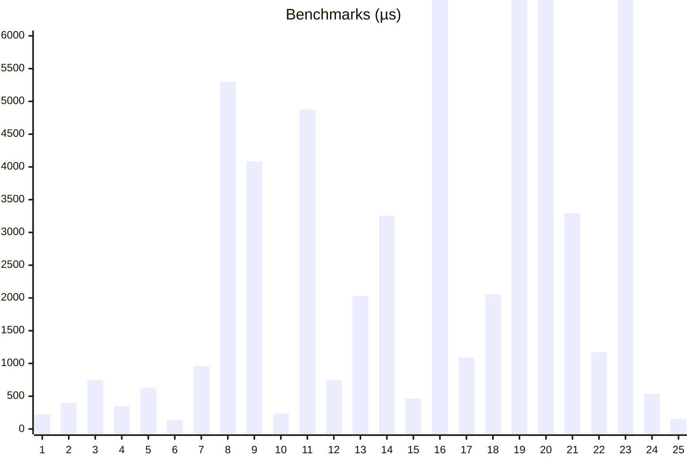

# Advent of Code 2022

Doing AoC2022 in Rust, one puzzle per week.

To run, simply pass the day and (optionally) part to `cargo run`. For example, to run day 2 part 1, at the terminal type


```bash
$ cargo run -- 2 1 
```

Note that the time elapsed which gets printed is quite coarse estimate of the actual time the solution takes to run, since it includes the time taken to dispatch to the appropriate function. Note also that the input is parsed twice (once for each part of the puzzle).

A set of timings (from running on an Intel i7-10700 CPU @ 2.90GHz processor) can be found under [benchmark.txt](./benchmark.txt) and below,



Days 16 (15ms), 19 (22ms), 20 (60ms), and 23 (150ms) were particularly slow. 
